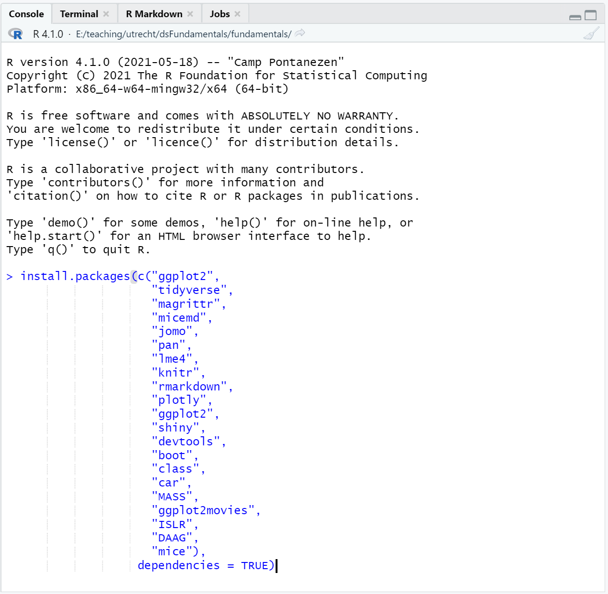

# Intro {.sidebar data-width=300}

This dashboard covers the course materials for the course 
[***Fundamental Techniques in Data Science with R***][ftds]

---

Course Coordinator: [Laura Boeschoten](https://www.uu.nl/medewerkers/LBoeschoten) <br>
Lecture Instructor: [Kyle Lang](https://www.kylemlang.com) <br>
WG Instructor: [Laura Boeschoten](https://www.uu.nl/medewerkers/LBoeschoten) <br>
WG Instructor: [Rianne Kraakman](https://www.uu.nl/staff/AMKraakman) <br>
Study load: 7.5 ECTS <br>
Assessment: Assignments and Exam <br>
[Course SurfDrive folder][sd]

---

| What?   | When?               | Where?                |
|---------|---------------------|-----------------------|
|         |                     |                       |
| Lecture | 2021-11-15<br>17:15 | Ruppert<br>Blauw      |
| WG1     | 2021-11-18<br>09:00 | Ruppert<br>011        |
| WG3     | 2021-11-18<br>09:00 | Androclus<br>C023     |
| WG2     | 2021-11-18<br>11:00 | Ruppert<br>011        |
|         |                     |                       |
| Lecture | 2021-11-22<br>17:15 | Ruppert<br>Blauw      |
| WG1     | 2021-11-25<br>09:00 | Ruppert<br>011        |
| WG3     | 2021-11-25<br>09:00 | Androclus<br>C023     |
| WG2     | 2021-11-25<br>11:00 | Ruppert<br>011        |
|         |                     |                       |
| Lecture | 2021-11-29<br>17:15 | Ruppert<br>Blauw      |
| WG1     | 2021-12-02<br>09:00 | Ruppert<br>011        |
| WG3     | 2021-12-02<br>09:00 | Androclus<br>C023     |
| WG2     | 2021-12-02<br>11:00 | Ruppert<br>011        |
|         |                     |                       |
| Lecture | 2021-12-06<br>17:15 | Ruppert<br>Blauw      |
| WG1     | 2021-12-09<br>09:00 | Ruppert<br>011        |
| WG3     | 2021-12-09<br>09:00 | Androclus<br>C023     |
| WG2     | 2021-12-09<br>11:00 | Ruppert<br>011        |
|         |                     |                       |
| Lecture | 2021-12-13<br>17:15 | Ruppert<br>Blauw      |
| WG1     | 2021-12-16<br>09:00 | Ruppert<br>011        |
| WG3     | 2021-12-16<br>09:00 | Androclus<br>C023     |
| WG2     | 2021-12-16<br>11:00 | Ruppert<br>011        |
|         |                     |                       |
| Lecture | 2021-12-20<br>17:15 | Ruppert<br>Blauw      |
| WG1     | 2021-12-23<br>09:00 | Ruppert<br>011        |
| WG3     | 2021-12-23<br>09:00 | Androclus<br>C023     |
| WG2     | 2021-12-23<br>11:00 | Ruppert<br>011        |
|         |                     |                       |
| Lecture | 2021-01-10<br>17:15 | Ruppert<br>Blauw      |
| WG1     | 2021-01-13<br>09:00 | Ruppert<br>011        |
| WG3     | 2021-01-13<br>09:00 | Androclus<br>C023     |
| WG2     | 2021-01-13<br>11:00 | Ruppert<br>011        |
|         |                     |                       |
| Lecture | 2021-01-17<br>17:15 | Ruppert<br>Blauw      |
| WG1     | 2021-01-20<br>09:00 | Ruppert<br>011        |
| WG3     | 2021-01-20<br>09:00 | Androclus<br>C023     |
| WG2     | 2021-01-20<br>11:00 | Ruppert<br>011        |
|         |                     |                       |
| Exam    | 2021-01-26<br>19:00 | Education<br>Theatron |

---

# Quick Overview

## Column 1 {data-width=400}

### 

In nine weeks, you will learn the basics of data handling with R and details 
about regression techniques in the context of statistical inference. We will 
also cover the connection between these concepts and research philosophy. During 
every lecture, we will cover a different theoretical topic. In addition to the 
lectures, there will also be a weekly computer lab exercise that connects the 
statistical theory to practice. You will also attend weekly workgroup meetings 
wherein you will work on solving motivating, real-world case studies. 

### Assignment and Grading

The final grade is computed as follows

| Grade Component | Weight |
|:-------|:------|
| Linear Regression Assignment & Presentation | 25% |
| Logistic Regression Assignment | 25% |
| Written Exam | 50% |

In addition to the grade components listed above, you will also do seven `R` 
exercises. These exercises will develop the skills needed to successfully 
complete the assignments and the presentations. The exercises will be graded on 
a completion basis. 

- You must finish 6 out of the 7 exercises to pass the course.

To pass the course:

1. Your final grade must be 5.5 or higher
1. You must pass both assignments
1. You must submit at least 6 `R` exercises

## Column 2 {data-width=400}

### Schedule

| Week #  | Topic   | `R`-practical | Workgroup | 
|---|---------|-----------|-----------|
| 1 | The elemental building blocks of `R` | Assigning objects and elements; creating vectors, matrices, dataframes and lists | Receive instructions and form groups |
| 2 | Finding the least squares solution; simple linear regression | Subsetting data; using pipes to simplify the workflow | Locate a data set for predictive modeling and formulate a research hypothesis; make sure the data can support both linear and logistic regression |
| 3 | Linear modeling in `R`; testing assumptions; standardized residuals, leverage, and Cook's distance | The `lm()` function in `R`; modeling, prediction, and visualization | Fit your defined model; evaluate if assumptions are met |
| 4 | Inferential modeling; Confidence intervals and hypothesis testing, non-constant error variance | Investigate the assumptions of linear modeling | Test and quantify the effect of the defined model; continue the project in `rmarkdown` |
| 5 | Model evaluation; cross-validation; categorical variables, non-linear relations, interactions, and higher-order polynomials | Cross-validation and model fit in `R` | Evaluate if the model can be improved; **Prepare Assignment 1; evaluate the final linear model on your own data** |
| 6 | Simple logistic regression | The `glm()` function in `R`; modeling, prediction, and visualization | Fit your defined model; evaluate if the assumptions are met |
| 7 | Formulating a logistic regression model and interpreting the parameters; marginal effects | Parameter transformations; scale of the linear predictor/outcome; prediction and confidence intervals | Test and quantify the effect of the defined model |
| 8 | Logistic regression model evaluation; cross-validation; multiple logistic regression; interactions | Multiple logistic regression and cross-validating the logistic regression model in `R` | Evaluate if the model can be improved; **Prepare Assignment 2; evaluate the final logistic model on your own data** |

<!----------------------------------------------------------------------------->

# Course Manual

## Column 1

### Course Description

Regression techniques are widely used to quantify the relationship between two 
or more variables, and investigating such relations is common in data science. 
Linear and logistic regression are well-established and powerful 
techniques for analyzing the relations between a set of (predictor) variables 
and a single (outcome) variable. However, you must understand how and when it is 
appropriate to apply these regression techniques before you can use them in any 
beneficial way. In this course, you will learn exactly that: how and when to 
apply linear and logistic regression with the statistical software package `R`. 
 
This course gives students a new set of tools that they can apply to real-world 
data to explore interesting issues and problems. The course will introduce 
students to the principles of analytic data science, linear and 
logistic regression, and the basics of statistical learning. These techniques 
will be presented in the context of estimation, testing, and prediction. 
Students will learn to think carefully and critically about statistical 
inference, quantifying uncertainty, and measuring the accuracy of statistical 
estimates. Students will also develop fundamental `R` programming skills and 
will gain experience with `tidyverse`: visualizing data with `ggplot2` and 
performing basic data wrangling with `dplyr`. This course will prepare students 
for basic research tasks (e.g. junior researcher or research assistant) or 
further education in research, such as a (research) Master program. 

### Assignments

Students will form groups to work on two assignments. Students will need to 
perform calculations and write `R` code for these assignments. All work must be 
combined into an understandable and insightful `R` project and must be 
submitted to the [Surfdrive file drop environment][sd]. 

Each assignment will be graded on the quality of the following components:

1. The methodological application
1. The model evaluation and assumption checking
1. The code and scripts 

### Grading

Students will be evaluated on the following aspects:
 
1. Apply and interpret the basic methodological and statistical concepts 
underlying predictive and/or inferential research.

   a. Explain concepts from inferential statistics, such as probability, 
   inference, and modeling; apply these concepts in practice. 
   a. Make an informed choice of research designs that are suitable for 
   regression analyses.
   a. Apply and explain the choice of techniques for investigating data problems.
   a. Apply and explain the concepts of linearity and non-linearity.
   a. Interpret statistical software output, and report software output 
   following APA reporting guidelines.
   a. Explain and conceptualize statistical inference and its relation to 
   statistical theory.
   a. Perform the different steps of solving basic regression analysis problems 
   and report on these steps.

<br>

2. Apply and interpret important techniques in linear and logistic regression 
analysis.

   a. Perform, interpret, and evaluate quantitative (causal) analyses on data 
   with the statistical software platform `R`.
   a. Perform analyses in statistical software.
 
### Relation between Assessment and Objective

In this course, skills and knowledge are evaluated in three separate ways:

- The exam evaluates the knowledge of methodological and statistical concepts 
(learning goals 1a, 1d, 1f), as well as the application of these concepts to 
research scenarios (learning goals 1b and 1c). During the exam students will 
need to interpret statistical software output (learning goal 1e).

- The practical labs test if the student has sufficient skills to solve basic 
analysis problems and execute quantitative analyses on real-life data sets 
(learning goals 2a and 2b).

- The workgroups focus on applying the newly gained knowledge and skills to 
solving relevant data analysis problems and reporting on the steps taken to 
obtain a solution (learning goal 1g).

<!----------------------------------------------------------------------------->

# Preparation

## Column 1

###

Hello All, 

This semester, you will participate in the **Fundamental Techniques in Data 
Science with `R`** course at Utrecht University. In this course, you will use 
both `R` and `RStudio`. The below steps guide you through installing both `R` 
and `RStudio`. Please do so before the first meeting. 

Regards,  
Instructor Team

### **System requirements**

Bring a laptop computer to the course and make sure that you have full write 
access and administrator rights on the machine. We will explore programming and 
compiling in this course, so you will need full access to your machine. Some 
corporate laptops come with limited access for their users, I therefore advise 
you to bring a personal laptop to the workgroup meetings. 

### **1. Install `R`**

You can obtain a copy of `R` [here](https://cran.r-project.org). We won't use 
`R` directly in the course. Rather, we'll call `R` through `RStudio`. Therefore, 
you also need to install `RStudio`. 

### **2. Install `RStudio` Desktop**

`RStudio` is an Integrated Development Environment (IDE) for `R`. You can 
download `RStudio` as stand-alone software [here](https://www.rstudio.com/products/rstudio/download/#download). 
The free and open-source `RStudio Desktop` version is sufficient.

### **3. Start RStudio and install the following packages. **

Open `RStudio`, and copy-paste the following lines of code into the console 
window to execute them.

- If nothing happens after you paste the code, try hitting the "Enter/Return" 
key.

```{r eval = FALSE, echo = TRUE}
install.packages(c("ggplot2", 
                   "tidyverse", 
                   "magrittr", 
                   "micemd", 
                   "jomo", 
                   "pan", 
                   "lme4", 
                   "knitr", 
                   "rmarkdown", 
                   "plotly", 
                   "ggplot2", 
                   "shiny", 
                   "devtools", 
                   "boot", 
                   "class", 
                   "car", 
                   "MASS", 
                   "ggplot2movies", 
                   "ISLR", 
                   "DAAG", 
                   "mice"), 
                 dependencies = TRUE)
```

If you are not sure where to paste the code, use the following figure to 
identify the console:

<center>
  
</center>

When you are asked the following:

```{r eval = FALSE, echo = TRUE}
Do you want to install from sources the package which needs 
compilation? (Yes/no/cancel)
```

Type `Yes` in the console, and press the "Enter/Return" key (or click the 
corresponding button if the question presents as a dialog box). 

## Column 2

### **What if the steps to the left do not work for me?**

If the suggested steps fail or you have insufficient rights on your machine, you 
can use the following web-based solutions. 

1. Open a free account on [rstudio.cloud](https://rstudio.cloud). 

   - You can run your own cloud-based `RStudio` environment there.
   
<br>

2. Use Utrecht University's [MyWorkPlace](https://myworkplace.uu.nl/). 

   - You will have access to `R` and `RStudio` there. When you start a new 
   MyWorkPlace session, you may need to (re)install packages. 

Naturally, you will need internet access to use these services. 

<!----------------------------------------------------------------------------->

# Week 1

## Column 1

### Lecture (Monday)

Today's lecture is about the elemental building blocks of `R`. We will discuss 
what `R` actually is, why we use `RStudio`, how to 'speak' `R`, and how to work 
with `R` objects. 

You can find the slides [here](wk1/lecture1.html)

### Workgroup (Thursday)

You should attend all workgroup meetings; however, **today's meeting is vital**! 
We will form groups, and we will discuss the assignments and expectations for 
your work in this course. 

**Please do not forget to complete 
[`R` Exercise 1](wk1/exercise/exercise1.html) before the workgroup meeting!**

### Useful Information and Links

These links point to useful references that connect to this week's material. 

- [The tidyverse style guide](https://style.tidyverse.org)
- [R for Data Science](https://r4ds.had.co.nz): A great book that details a 
useful toolset for current and aspiring data scientists.

## Column 2

### `R` Exercise
This week's `R` exercise comes in three parts. We need to cover a lot of ground 
this week to get you ready for the rest of the course.

- Complete [Exercise 1](wk1/exercise/exercise1.html) before Thursday's workgroup 
meeting. This exercise will get you started with `R` and `RStudio`.

- Complete [Exercise 2](wk1/exercise/exercise2.html) during Thursday's workgroup 
meeting. Laura will be available to help you during that time. 

- Complete and submit [Exercise 3](wk1/exercise/exercise3.html) before the next 
lecture. For this week, you only need to present the `R` code for the relevant 
exercises.

A video discussion of the exercises is available below.  

Submit an `R` script containing your answers to Exercise 3 to the 
[SurfDrive][sd] drop folder. Name the file `Yourname.R`, where `Yourname` is 
your name. Do this ***before the next lecture***. 

<!--
### Exercise Discussion
The video discussions for the practical exercises:

- [Exercise 1 discussion](https://www.dropbox.com/s/qgxlrrl808klmjq/Exercise1_discussion.mp4?dl=0)
- [Exercise 2 discussion](https://www.dropbox.com/s/7bxqj6gn7occ0yr/Exercise%202_discussion.mp4?dl=0)
- [Exercise 3 discussion](https://www.dropbox.com/s/dl5jklj4oixfpxd/Exercise3_discussion.mp4?dl=0)
-->

<!----------------------------------------------------------------------------->

# Week 2

## Column 1

### Lecture (Monday)
Today's lecture has two parts:

1. Let's explore pipes: a more efficient way of organizing our `R` code that forces you to think about the analytical process while being more memory efficient.
2. We look at squared deviations and see how useful these calculations can be. From there we leap to least-squares estimation and start with simple linear regression.

You can find the [slides here](Wk2/Lecture_2_FTID.html)

### Workgroup (Thursday)
**Today's workgroup is online. See the Teams channel.**


## Column 2

### `R` exercise
This week's `R` exercise is about getting familiar with pipes and exploring the simple linear model.

- Make [Exercise 4](Wk2/Exercise/Exercise_4_walkthrough.html) before Thursday's workgroup.

Hand in a markdown compiled `html` + `Rmd` file for Exercise 4: Question 11 to the [SurfDrive][sd] drop folder. Name the file `Yourname.Rmd/html`, where `Yourname` is your name. Do this ***before the next lecture on Monday***.  

### Useful References

- [`magrittr`](https://magrittr.tidyverse.org)
- [`R` for Data Science](http://r4ds.had.co.nz) - [Chapter 18 on pipes](http://r4ds.had.co.nz/pipes.html)

The above links are useful references that connect to this week's materials.

### Exercise answers
The answers to the fourth practical exercises:

- [Exercise 4 answers](Wk2/Exercise/Exercise_4_answers.html)

# Week 3

## Column 1

### Lecture (Monday)
Today's lecture is about linear modeling and its assumptions. Linear modeling is the ubiquitous work horse that is used for estimation throughout contemporary data science. However, its application has limits. We explore the application and the limits in this lecture.

You can find the [slides here](Wk3/Lecture_3_FTID.html)

### Workgroup (Thursday)
**Today's workgroup is online. See the Teams channel.**

## Column 2

### `R` exercise
This week's `R` exercise is about getting familiar with the linear model.

- Make [Exercise 5](Wk3/Exercise/Exercise-5.html) before Thursday's workgroup.

Hand in a markdown compiled `html` file for Exercise 5 to the [SurfDrive][sd] drop folder. Do this ***before the next lecture on Monday***.

<!-- ### Solution to the exercise -->
<!-- You can find the answers to this week's exercise in [the exercise for next week](Wk4/Exercise/Exercise_6.html). -->

<!-- - The video discussion can also be found in [next week's dashboard](https://www.gerkovink.com/fundamentals/#week-4) -->

### Required reading

- From [Introduction to Statistical Learning](https://statlearning.com) read [Chapter 3 on Linear Regression](https://static1.squarespace.com/static/5ff2adbe3fe4fe33db902812/t/6009dd9fa7bc363aa822d2c7/1611259312432/ISLR+Seventh+Printing.pdf) up to and including 3.1.1

These readings are exam materials.

# Week 4

## Column 1

### Lecture (Monday)
Today's lecture is about statistical inference. Inference is the process of drawing conclusions about true data generating models (TDGM). The most widely know TDGM is the population, the body we aim to infer about in social science and in classical statistics.

Even though statistical inference has been around for a long time, it's associated components, quantities and estimands are not always straightforward. Let's dive a bit deeper into that today, but in order to do so, we need some knowledge about statistical sampling and some widely used distributions. That is why we start today's lecture with random numbers and data generation in `R`.

You can find the [slides here](Wk4/Lecture-4_FTID.html)

### Workgroup (Thursday)
**Today's workgroup is online. See the Teams channel.**

## Column 2

### `R` exercise
This week's `R` exercise is about getting familiar with the linear model.

- Make [Exercise 6](Wk4/Exercise/Exercise_6.html) before Thursday's workgroup.

Hand in a markdown compiled `html` file for Exercise 6 to the [SurfDrive][sd] drop folder. Do this ***before the next lecture on Monday***.

### Solution to the exercise
You can find the answers to this week's exercise and to the previous week's exercise [here](Wk4/Exercise/Exercise_6_answers.html). Use these answers only when you are stuck. 

Video discussion of the exercises in two parts:

 - [Part 1](https://www.dropbox.com/s/i47g1pinm0dpt2r/Exercise45_discussion.mp4?dl=0)
 - [Part 2](https://www.dropbox.com/s/l1actd5o6si2tx1/Exercise45_discussion_part2.mp4?dl=0)

### Useful Information and links

- [These lecture notes](http://www.mit.edu/~6.s085/notes/lecture3.pdf) cover the essence of the coming two weeks. 
- From [Introduction to Statistical Learning](https://statlearning.com) read [Chapter 3 on Linear Regression](https://static1.squarespace.com/static/5ff2adbe3fe4fe33db902812/t/6009dd9fa7bc363aa822d2c7/1611259312432/ISLR+Seventh+Printing.pdf) up to and including 3.4

These readings are exam materials.

# Week 5

## Column 1

### Lecture (Monday)
Today's lecture is about being a skilled modeler. There is a famous quote that is generally attributed to [George Box](https://en.wikipedia.org/wiki/George_E._P._Box):

\[\text{All models are wrong, but some are useful}\]

Today we dive deeper into why and how this statement applies. We also explore techniques to infer the usefulness of a model, given that it is wrong anyway.

You can find the [slides here](Wk5/Lecture_5_FTID.html)

### Workgroup (Thursday)
**Today's workgroup is online. See the Teams channel.**

## Column 2

### `R` exercise
This week's `R` exercise is about getting more familiar with the linear model and its usefulness.

- Make [Exercise 7](Wk5/Exercise/Exercise_7.html). 

**No need to hand in any work; but make sure that you understand the contents, code and train ot thought of the document. If not, ask Gerko or Laura.**


### Useful Information and links

- I have prepared [a document about interpreting cross validation results](Wk5/Exercise/Example_CVlm.pdf)
- [This online page](https://www.dummies.com/education/math/statistics/using-linear-regression-to-predict-an-outcome/) details the relation between correlation and prediction
- [This blog post by Jonathan Barlett](https://thestatsgeek.com/2014/01/25/r-squared-and-goodness-of-fit-in-linear-regression/) gives a nice detail about $R^2$ and how it is useless on a wrongly specified model
- [This other blog post by Jonathan](https://thestatsgeek.com/2013/10/28/r-squared-and-adjusted-r-squared/) details the usefulness of adjusted $R^2$

These readings are exam materials. Also useful, but not exam material is:

- Chapter XIV on regression in [this online book](http://onlinestatbook.com/2/regression/regression.html)

# Week 6

## Column 1

### Lecture (Monday)
Today's lecture is about logistic regression. We explore the basics of this method today and continue with a more in-depth exploration in the next weeks. 

You can find the [slides here](Wk6/Lecture_6_FTID.html)

### Workgroup (Thursday)
**Today's workgroup is online. See the Teams channel.**

## Column 2

### `R` exercise
This week's `R` exercise is about getting familiar with fitting the logistic regression model. 

- Make [Exercise 8](Wk6/Exercise/Exercise_8.html). 

**To allow you to enjoy the holidays, there is no need to hand in any work; but make sure that you understand the contents, code and train ot thought of the document. If not, ask Gerko or Laura.**

### Useful Information and links

- [Read this page on interpreting logistic regression](https://stats.idre.ucla.edu/other/mult-pkg/faq/general/faq-how-do-i-interpret-odds-ratios-in-logistic-regression/)
- From [Introduction to Statistical Learning](https://statlearning.com) read [Chapter 4 on Logistic Regression](https://static1.squarespace.com/static/5ff2adbe3fe4fe33db902812/t/6009dd9fa7bc363aa822d2c7/1611259312432/ISLR+Seventh+Printing.pdf) up to and including 4.3.4

These readings are exam materials.

# Week 7

## Column 1

### Lecture (Monday)
Today we continue with logistic regression. We'll use the titanic data to demonstrate the technique and we will explore some ways to evaluate the usefulness of the fitted models. 

You can find the [slides here](Wk7/Lecture_7_FTID.html)

### Workgroup (Thursday)
**Today's workgroup is online. See the Teams channel.**


## Column 2

### `R` exercise

[The titanic.csv data](data/titanic.csv)

This week's exercise is to:
1. Recreate the plots from slides 28 and 29, but now for females
2. For the model with the interactions:
  
  - Create a confusion matrix for the model with the interactions
  - Perform crossvalidation on the `titanic` model with the interactions

3. See if a model with all variables included is a better fit than the model with the interactions presented in the slides. 
  - The model with all variables (excluding `Name`!) can be simply fit with `glm(Survived ~ . * ., data = titanic[, -3])`
  - The `.` here implies all remaining columns in the data. `. * .` yields the full factorial model between all these columns. 

Hand in a markdown compiled `html` file for Exercise 9 to the [SurfDrive][sd] drop folder. Do this ***before the next lecture on Monday***.

### Useful Information and links
- [Study this page on inspecting logistic regression](https://stats.idre.ucla.edu/r/dae/logit-regression/)

These readings are exam materials.

# Week 8

## Column 1

### Lecture (Monday)
Today we will wrap up this course. I'll give you an overview of the highlights and introduce only a few new concepts. 

You can find the [slides here](Wk8/Lecture_8_FTID.html)

### Workgroup (Thursday)
**Today's workgroup is online. See the Teams channel.**

## Column 2

### `R` exercise
No exercise for this week. I believe that you have been given the proper skillset to solve the assignments in this course. Use your time to improve your skills. 

Do not forget to include the newly introduced concepts for this week in your Assignment 2. 

# Exam material

## Column 1

### **Practice exam**
You can find the [practice exam here](https://gerkovink.shinyapps.io/Practice_Exam_FTiD)

### **What can be tested**

[This page as a pdf](Archive/Exam_materials_pdf.pdf)

The information in the lecture slides:

- The lectures:

  - [Lecture 1](Wk1/Lecture-1_FTID.html)
  - [Lecture 2](Wk2/Lecture_2_FTID.html)
  - [Lecture 3](Wk3/Lecture_3_FTID.html)
  - [Lecture 4](Wk4/Lecture-4_FTID.html)
  - [Lecture 5](Wk5/Lecture_5_FTID.html)
  - [Lecture 6](Wk6/Lecture_6_FTID.html)
  - [Lecture 7](Wk7/Lecture_7_FTID.html)
  - [Lecture 8](Wk8/Lecture_8_FTID.html)

and the information in the following sources these lecture slides are based on:

- [Introduction to Statistical Learning](https://static1.squarespace.com/static/5ff2adbe3fe4fe33db902812/t/6009dd9fa7bc363aa822d2c7/1611259312432/ISLR+Seventh+Printing.pdf)
  - Chapter 2: up to and including 2.2.2
  - Chapter 3: up to and including 3.4
  - Chapter 4: up to and including 4.3.4
  - Chapter 5: up to and including 5.1
  
- [These lecture notes](http://www.mit.edu/~6.s085/notes/lecture3.pdf).
- [This document](Wk5/Exercise/Example_CVlm.pdf) I prepared about interpreting cross validation results
- [This online page](https://www.dummies.com/education/math/statistics/using-linear-regression-to-predict-an-outcome/) that details the relation between correlation and prediction
- [This blog post by Jonathan Barlett](https://thestatsgeek.com/2014/01/25/r-squared-and-goodness-of-fit-in-linear-regression/) that details $R^2$ and explains how it is useless on a wrongly specified model
- [This other blog post by Jonathan](https://thestatsgeek.com/2013/10/28/r-squared-and-adjusted-r-squared/) about adjusted $R^2$
- [This page](https://stats.idre.ucla.edu/other/mult-pkg/faq/general/faq-how-do-i-interpret-odds-ratios-in-logistic-regression/) on interpreting logistic regression
- [This page](https://stats.idre.ucla.edu/r/dae/logit-regression/) on inspecting logistic regression

### **What about equations and formulae?**

Your knowledge of matrix algebra will not be tested. So, there is no need to memorize that the regression estimates $\beta$ can be estimated as $\hat{\beta} = ({\bf X}^T{\bf X})^{-1}{\bf X}^Ty$. However, you will need to know, understand and apply equations such as: 

- $y = \beta_0 + \beta_1X+\epsilon$ and any more complicated version of this. 
- $\epsilon = y - \hat{y}$
- $\mathbb{E}[y] = \alpha + \beta x.$
- $\log(\text{odds}) = \log(\frac{p}{1-p}) = \log(p) - \log(1-p) = \text{logit}(p)$
- $p_i = \frac{\text{exp}(\eta)}{1+\text{exp}(\eta)} = \frac{\text{exp}(\beta_0 + \beta_1x_{1,i} + \dots + \beta_nx_{n,i})}{1+\text{exp}(\beta_0 + \beta_1x_{1,i} + \dots + \beta_nx_{n,i})}$
- etcetera

### **What if you are in doubt?**

If any of the course materials confuse you, [drop me a line](mailto:G.Vink@uu.nl?subject=Question About Exam Materials) and I'd be more than happy to explain. 

**The second half of the last lecture is dedicated to a Q&A**


[ftds]: https://osiris.uu.nl/osiris_student_uuprd/OnderwijsCatalogusSelect.do?selectie=cursus&cursus=201900026&collegejaar=2021&taal=en
[sd]: https://surfdrive.surf.nl/files/index.php/s/IQ517X5UitVOayk
