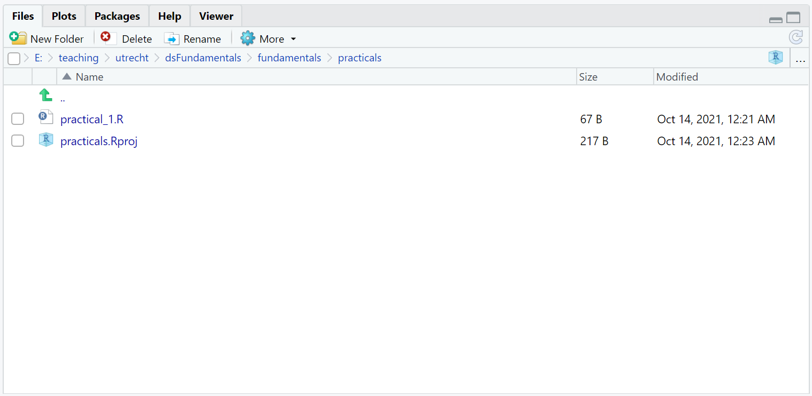

<style type="text/css">

body{ /* Normal  */
      font-size: 13px;
  }
td {  /* Table  */
  font-size: 12px;
}
h1.title {
  font-size: 30px;
  color: DarkBlue;
}
h1 { /* Header 1 */
  font-size: 24px;
}
h2 { /* Header 2 */
    font-size: 18px;
}
h3 { /* Header 3 */
  font-size: 18px;
}
code.r{ /* Code block */
    font-size: 12px;
}
pre { /* Code block - determines code spacing between lines */
    font-size: 14px;
}
</style>


---

In this preparation practical you will get acquainted with R and RStudio. This practical is meant to get students that are not familiar with R or Rstudio to a level of familiarity with R so you can start the workgroups of this course with confidence. 

Please note that RStudio adds many convenience features to the base R that you obtained from [http://r-project.org](http://r-project.org). Most of these features go beyond the scope of this course, but some of them will flatten the learning curve of R programming. 

<br>

*If you have any questions about R or this preparation practical, feel free to contact Kyle or any of your workgroup instructors.*


---

# Working with R and RStudio

## Opening RStudio

When opening RStudio, the following window will appear. 
<br>


RStudio is divided into 3 panes: the console, the environment/history pane, and 
a pane wherein you can access your files, plots, help files, etc. You can 
rearrange the panes through RStudio's preferences (*View > Panes > Pane Layout ...*).

When we open an R script (i.e. a file that contains R code), a fourth pane will 
open to show the script. This pane is called the *source pane*.

---

## Opening a new R script

In the top left you will find this button: 
{width=5%}. Click it and select "R Script". 

A new pane will open, and you can start writing code in this new script. Unless 
you're just using R as a simple calculator, you should work with R scripts 
instead of writing your code directly in the console. Doing so has at least the 
following advantages. 

a. You will not lose your work, since all of the commands you execute are 
written in a script.  
a. You log your workflow. Code does not disappear over time, so you can always 
tell what analyses you did for a project. 
a. With access to your R script(s) and data, others can exactly reproduce your 
work.  
a. Your coding will become more organized as you start trying to write more 
readable code. In the long run, this increased organization will make you a more 
efficient programmer. Remember: Efficient code runs faster! 

---

## Code and comments in an R script

```{r}
# Hey, Buddy! Let's assign the value 100 to the object a.
a <- 100
```

The comment character, `#`, tells the R interpreter to ignore everything that 
follows in that specific line. Since nothing following a `#` will be interpreted 
as R code, you can use `#` to comment your code. 

The line `a <- 100` assigns the value `100` to the object `a`. When you run this 
line, a new object called `a` will be saved to your environment and given the 
value `100`. The value `100` and the name `a` are completely arbitrary. You 
could just as well assign the value`"bar"` to the object `foo`, if you like. 

---

## Running commands in your script

Select both lines of code shown above, and execute them by pressing Ctrl-Enter 
or Ctrl-R (Windows/Linux) or Cmd-Enter (Mac)

After your code is executed the results appear in the console. If you type `a` 
in the console, R will return the assigned value. Try it. 


The shortcut Ctrl-Enter or Cmd-Enter is your friend: it runs the current 
selection, or---if nothing is selected---the current line. If pressing 
Ctrl-Enter or Cmd-Enter yields no result, you probably have the console pane 
selected. You can switch to the code pane by using the mouse to click on the 
desired line in the code pane or by pressing Ctrl-1 (Windows/Linux/Mac). You can 
select the console by pressing Ctrl-2 (Windows/Linux/Mac). 

---

## Saving scripts

Save your code file as *preparation_practical.R* in a folder named *practicals*.

You can use the standard Ctrl-s (Windows/Linux) or Cmd-s (Mac) or click on the 
{width=3%} icon in the code pane. Your document is
now saved. Saving your script in a separate folder will allow you to create an 
RStudio project for your practicals. 

---

## Closing files

**Close the *preparation_practical.R* script in the code pane**

Even though you've closed the script, your code is still saved as a permanent 
code file.

## Re-open a script

**Open the *preparation_practical.R* script**

1. Navigate to the *practicals* directory using the RStudio files pane.
1. Click on the *preparation_practical.R* file in the files pane to re-open the script. 
1. Run both lines of code again.
1. Inspect the contents of the global environment by executing the `ls()` 
function.

You should see something like the following
```{r}
ls()
```

There is only one object in the environment, and it is called `a`. If you look 
at the environment pane, you can quickly see which objects currently exist in 
the environment (i.e., you don't need to manually run `ls()`). You can also see 
some information about the objects.

---

# RStudio Projects

RStudio Projects are a great way to keep all the files associated with your project together in one place. This includes data, scripts, and any output you produce. RStudio Projects are built-in to RStudio and are recommended for best practice in open science, reproducible workflows, and collaboration. One huge advantage of working with an RStudio Project is that R knows where to find the data you are working with, without the need to explicitly set your directory every time using `setwd()`. 

The possibility of categorizing your work into projects is one of the benefits of using RStudio. Within a project, everything is related to the .Rproj file and the folder in which this .Rproj file is stored. So, if you share the project folder with someone else, they only have to open the .Rproj file to access and run any code from the project.

---

## Create a new RStudio project

Creating a new project is simple. Navigate to the top of your screen and click File > New Project.

{width=50% height=50%ar}

If you already made a folder which you would like to use as a directory for this project, you can click on "Existing Directory" and navigate to this folder. You will be asked to give your new project a name, once you have done this click "Create Project". It can be useful to create a new project for every practical. 

Alternatively, you can click on "New Directory" and create a new folder for your project. 


{width=50% height=50%}

You will see the file you just created appear in the RStudio files pane, as *nameofyourproject*.Rproj. 


{width=50% height=50%}

---

# RMarkdown

You can watch this video on Rmarkdown. 

[{width=50% height=50%}](https://vimeo.com/178485416 "WhatisRMarkdown - Click to Watch!")

Also, see this [R Markdown cheat sheet](https://www.rstudio.com/wp-content/uploads/2015/02/rmarkdown-cheatsheet.pdf).

## Code chunks

R Markdown files use the `rmarkdown` package which comes installed with RStudio. R Markdown is a variant of Markdown that enables us to create dynamic documents with chunks of R code embedded with plain-text. R Markdown works with `knitr` to compile these documents in different formats and has extensions that allow you to also include LaTeX equations. 

A code chunk is initiated by:

````r
```{r chunk-name}`r ''`
```{r}
```
````

Code chunks also end with three backticks:

````r
```
````

Therefore, an entire code chunk looks like:

````r
```{r hello}`r ''`

# This is a comment inside a code chunk

2 + 2
```
````

Naming your code chunks is also good practice, as it makes it easier to find errors that occur within specific chunks. For example, the first chunck above has the name `chunk-name`. Code chunks can be run in more than one way: you can run a single chunk by clicking the play icon at the top right corner of the chunk; you can also run all code chunks consecutively by clicking Run > Run all, in the top right corner of the RStudio editor pane. You will see more options in the drop-down list too.

When you compile an R Markdown document the code chunks are all evaluated and their output inserted, unless you provide alternate instructions via the chunk options. Chunk options follow the chunk name and are separated by commas.

**Chunk options:**

To omit the results from the final document (i.e. not run the code) add `eval = FALSE` to the brackets and after `r`, like below:

````r
```{r, eval = FALSE}`r ''`
2 + 2
```
````

To omit the code from the final report (while including the results) add the argument `echo = FALSE` to the brackets, like below:

````r
```{r, echo = FALSE}`r ''`
2 + 2
```
````

*`echo = FALSE` is also very useful for embedding plots into a report, because we usually only want to see the final plot and not the code that produced it.*

To run the code chunk but not include it in the final document add the argument `include = FALSE` to the brackets, like below:

````r
```{r, include = FALSE}`r ''`
2 + 2
```
````

*Note that for all the examples above, the default value for echo is `TRUE`.*

You can read more about chunk options [here](https://rpubs.com/Lingling912/870659). 


## Text option

Rmarkdown can handle different text formats:

1. **headers** - place one or more hashtags at the start of a line that will be a header (or a sub-header). For example, `# Hello Rmarkdown`.
    + A single hashtag, `#` creates a first level header.
    + Two hashtags, `##` create a second level header, and so on.
    
2. **italicized and bold text** - surround italicized text with asterisks, for example `*italicize this text*`. Surround bold text with double asterisks, for example, `**bold face this text**`.

3. **lists** - bullet-point lists can be created by starting a line with an asterisk `*`(you must leave an empty line before the first bullet point).

* Item 1
* Item 2
    + Item 2a
    + Item 2b

LaTeX equations can also be added to an RMarkdown document, using single `$` to produce an inline equation, e.g. `$equation$`, or double `$` for a display equation, e.g. `$$ equation $$`. 

You can read more about using LaTeX syntax in R Markdown [here](https://bookdown.org/yihui/rmarkdown/markdown-syntax.html#math-expressions).

## Creating and rendering the document

To open a new R Markdown file, navigate to the top left of the RStudio editor and click on the icon for a new document (see below). Choose a title for your document and select the "HTML" format. You will primarily create HTML files in this course but it is also possible to create Microsoft Word and PDF documents. 

{width=50% height=50%} 

**Compile the RMD script into an HTML file:**

Click the "knit" button button and select “Knit to HTML” to compile the file into an HTML document. If necessary, install the required packages.

{width=50% height=50%}

In the rest of this course, you will need to complete and submit exercises and assignments. The R Markdown functionality in RStudio is a well-polished production device to mark-up high quality documents where text and code/output are woven together.

Please use R Markdown to prepare your work for this course, and submit both the RMD and HTML files whenever you need to hand in exercises or assignments.

## Quarto documents

Recently, Rstudio included the option to create *Quarto documents* in RStudio. These documents are an alternative to Rmarkdown documents, having the same options and some improvements (e.g. visually). You can create a Quarto document the same way as an Rmarkdown document.

{width=30%}

Note that Quarto documents create extra folders with dependency files. Because of this, it is preferred to work with Rmarkdown instead of Quarto during this course.

---

# R packages 

An `R` package is a collection of functions, data, and documentation that have been
developed to cover a specific need or scientific method that is not implemented
in base `R`. 

You can install a package from CRAN (The Comprehensive `R` Archive Network) using 
the function `install.packages()`. You only need to do this once on your computer.

To then use the functions from that package, you need to load the package using 
the `library()` function.

Once loaded, you can use `?` or the `help()` function to see the documentation of 
any package or function in that package. 

We run through an example for the `tidyverse` package. `Tidyverse` is actually
a group of packages that can be together considered as a `dialect of the `R` 
language` that is very popular. We make use of its functions when possible. 


```{r eval=FALSE}
# Installing the tidyverse package 
install.packages("tidyverse")
```

```{r message=FALSE, warning=FALSE, eval = FALSE}
# Loading the tidyverse package
library("tidyverse")

# See the documentation of the tidyverse package
?tidyverse
# or 
help(tidyverse)

# Now you have loaded the tidyverse package, we can look up documentation
# of specific functions within that package, an example is the mutate function.
?mutate

# when you open the mutate documentation, you see that this function is part of 
# the dplyr package, which is a member of the tidyverse package family. This 
# means that we can also use the mutate function by loading only the dplyr package
# instead of the complete tidyverse family. 
```

Now try to install all packages that are listed on the preparations page on the 
course website. 

---


End of the preparation practical. \

Please note that this practical can be useful to get back to later in the course. If you have any questions or difficulties regarding this practical, feel free to contact any of the course instructors. 
