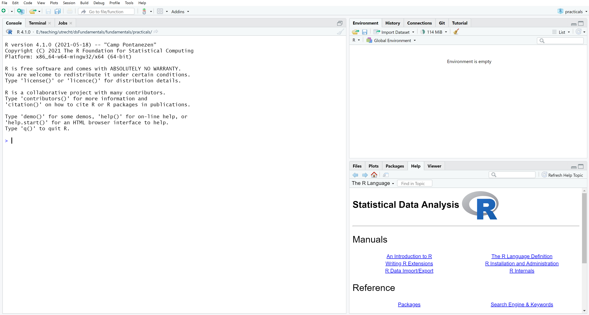

<style type="text/css">

body{ /* Normal  */
      font-size: 12px;
  }
td {  /* Table  */
  font-size: 12px;
}
h1.title {
  font-size: 18px;
  color: DarkBlue;
}
h1 { /* Header 1 */
  font-size: 18px;
}
h2 { /* Header 2 */
    font-size: 18px;
}
h3 { /* Header 3 */
  font-size: 18px;
}
code.r{ /* Code block */
    font-size: 12px;
}
pre { /* Code block - determines code spacing between lines */
    font-size: 14px;
}
</style>


---

In this exercise you will get acquainted with R and RStudio. RStudio adds many 
convenience features to the base R that you obtained from 
[http://r-project.org](http://r-project.org). Most of these features go beyond 
the scope of this course, but some of them will flatten the learning curve of R 
programming. 

If you have any questions, feel free to ask me or the workgroup instructor.

OK. Let's begin!

---

# Working with R and RStudio

---

## 

**Open RStudio**

The following window will appear. 


RStudio is divided into 3 panes: the console, the environment/history pane, and 
a pane wherein you can access your files, plots, help files, etc. You can 
rearrange the panes through RStudio's preferences.

When we open an R script (i.e. a file that contains R code), a fourth pane will 
open to show the script. 

---

## 

**Open a new R script**

In the top left you will find this button: 
{width=5%}. Click it and select "R Script". 

A new pane will open, and you can start writing code in this new script. Unless 
you're just using R as a simple calculator, you should work with R scripts 
instead of writing your code directly in the console. Doing so has at least the 
following advantages. 

a. You will not lose your work, since all of the commands you execute are 
written in a script.  
a. You log your workflow. Code does not disappear over time, so you can always 
tell what analyses you did for a project. 
a. With access to your R script(s) and data, others can exactly reproduce your 
work.  
a. You coding will become more organized as you start trying to write more 
readable code. In the long run, this increased organization will make you a more 
efficient programmer. Remember: Efficient code runs faster! 

---

## 

**Type the following into your new R script**

```{r}
# Hey, Buddy! Let's assign the value 100 to the object a.
a <- 100
```

The comment character, `#`, tells the R interpreter to ignore everything that 
follows in that specific line. Since nothing following a `#` will be interpreted 
as R code, you can use `#` to comment your code. 

The line `a <- 100` assigns the value `100` to the object `a`. When you run this 
line, a new object called `a` will be saved to your environment and given the 
value `100`. The value `100` and the name `a` are completely arbitrary. You 
could just as well assign the value`"bar"` to the object `foo`, if you like. 

---

## 

**Execute the commands in your script**

Select both lines of code shown above, and execute them by pressing Ctrl-Enter 
or Ctrl-R (Windows/Linux) or Cmd-Enter (Mac)

After your code is executed the results appear in the console. If you type `a` 
in the console, R will return the assigned value. Try it. 


The shortcut Ctrl-Enter or Cmd-Enter is your friend: it runs the current 
selection, or---if nothing is selected---the current line. If pressing 
Ctrl-Enter or Cmd-Enter yields no result, you probably have the console pane 
selected. You can switch to the code pane by using the mouse to click on the 
desired line in the code pane or by pressing Ctrl-1 (Windows/Linux/Mac). You can 
select the console by pressing Ctrl-2 (Windows/Linux/Mac). 

---

##

**Save your code file as *practical_1.R* in a folder named *practicals***

You can use the standard Ctrl-s (Windows/Linux) or Cmd-s (Mac) or click on the 
{width=3%} icon in the code pane. Your document is
now saved. Saving your script in a separate folder will allow you to create an 
RStudio project for your practicals. 

---

##

**Close the *practical_1.R* script in the code pane**

Even though you've closed the script, your code is still saved as a permanent 
code file. Notice the entry for *practicals/practical_1.R* in the files pane.

##

**Open the *practical_1.R* script**

1. Click on the *practical_1.R* file in the files pane to re-open the script. 
1. Run both lines of code again.
1. Inspect the contents of the global environment by executing the `ls()` 
function.

You should see something like the following
```{r}
ls()
```

There is only one object in the environment, and it is called `a`. If you look 
at the environment pane, you can quickly see which objects currently exist in 
the environment (i.e., you don't need to manually run `ls()`). You can also see 
some information about the objects.

---

# RStudio Projects

---

##

**Create a new RStudio project**

1. Click on the {width=15%} button in the 
top-right corner of RStudio. 
1. Select "New Project"
1. Click on "Existing Directory"
1. Navigate to the folder where you just saved your code.
1. Click on "Create Project".

You will notice that the file *practicals.Rproj* appears in the files pane.


The possibility of categorizing your work into projects is one of the benefits 
of using RStudio. Within a project, everything is related to the *.Rproj* file. 
So, if you share the project with someone else, they only have to open the 
*.Rproj* file to access and run any code from the project.

---

# RStudio Notebooks

---

##

**Open the R script *notebook.R***

You can download a ZIP archive containing *notebook.R* [here](notebook.zip).

---

##

**Have a look at the code in the script and make sure that you understand what 
it does.**

If you do not understand something, please ask me (Kyle) during the lecture or 
ask your workgroup instructor.

---
 
##

**Compile the script as an HTML file**

Click on the  icon and select "HTML" as the output 
format.

The benefit of using HTML as an output format lies in the dimensional properties 
of a web-page. Especially when dealing with long code files, large output from 
analyses, or many figures, exporting your file as HTML is much more convenient 
than using paginated output formats (e.g., MS Word, PDF). With HTML output, you 
can simply scroll down or up to any part of the document, instead of flipping 
through pages back and forth to compare code, graphs, or output. 

---

##

**Inspect the HTML file you have created**

The notebook feature in RStudio is very convenient; it runs any R code and 
converts the results into a readable file where code and output are both 
visible. There is, however, an even better format for integrating R code with 
text into a single document: **rmarkdown**!

---

# Markdown

---

## About rmarkdown

<center>
<iframe src="https://player.vimeo.com/video/178485416?color=428bca&title=0&byline=0&portrait=0" width="500" height="315" frameborder="0" webkitallowfullscreen mozallowfullscreen allowfullscreen></iframe>
<p><a href="https://vimeo.com/178485416">What is R Markdown?</a> from <a href="https://vimeo.com/rstudioinc">RStudio, Inc.</a> on <a href="https://vimeo.com">Vimeo</a>.</p>
</center>

Also, see this [rmarkdown cheat sheet](https://rstudio.com/wp-content/uploads/2015/02/rmarkdown-cheatsheet.pdf). 

---

##

**Open the file *markdown.Rmd***

You can download a ZIP archive containing *markdown.Rmd* [here](markdown.zip)

Have a look at the code in the *markdown.Rmd* file and make sure that you 
understand what's going on. If you do not understand what you are looking at, 
please ask me (Kyle) during the lecture, or ask your workgroup instructor. 

---

##

**Compile the RMD script into an HTML file**

1. Click the  button and select "Knit to HTML" 
to compile the file into an HTML document. 
   - If necessary, install the required packages. 
1. Inspect the HTML file and compare it to the one you created from the 
*notebook.R* file.

In the rest of this course, you will need to complete and submit exercises and 
assignments. The notebook functionality is a convenient way to quickly compile 
code and output into a quick-and-dirty report that you can discuss with others. 
The rmarkdown functionality in RStudio, on the other hand, is a well-polished 
production device to mark-up high quality documents where text and code/output 
are woven together. 

- Please use rmarkdown to prepare your work for this course, and submit both the 
RMD and HTML files whenever you need to hand in exercises or assignments. 

---

End of Exercise 1 
