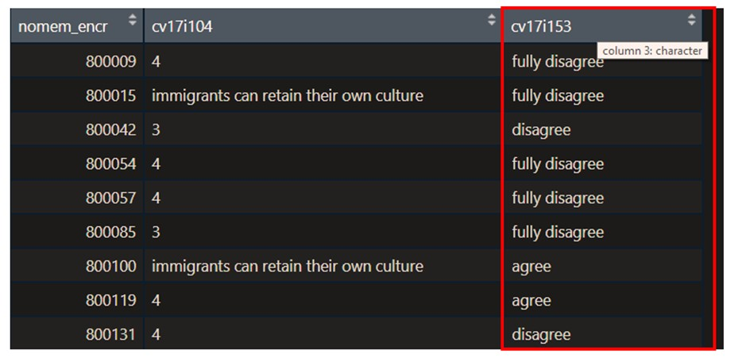
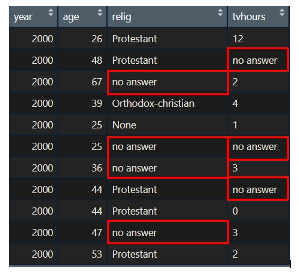
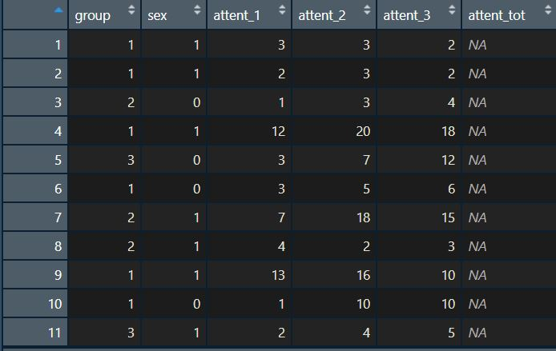

<style>
h2{
  color: black;
}

h3{
  color: black;
  font-family: "Rockwell";
  text-align: left;
}

h4{
  color: grey;
  font-family: "Rockwell";
  text-align: left;
}

.forceBreak { -webkit-column-break-after: always; break-after: column; }

.horizontal {
  display:inline-block;
  width: 20%;
}

</style>

```{r setup, echo = FALSE, warning = FALSE}
library(ggplot2)
library(mvtnorm)
set.seed(235711)
theme_update(plot.background = element_rect(fill = "transparent", colour = NA))
knitr::opts_chunk$set(warning = FALSE, 
                      message = FALSE, 
                      dev.args = list(bg = "transparent"), 
                      fig.align = "center")
```


## This Workgroup Meeting

<h3> 1\. Some examples on processing </h3>
<h3> 2\. Continue with processing of the data set </h3>


## Assignment 1

<h4>You perform a multiple linear regression analysis in R and report this using R markdown. The assignment will be graded on the following four elements:</h4><br>

-	<b>Context:</b> Introduction of your research questions, description and potential processing of your data. (Week 1 & 2) 
- <b>Exploratory data analysis:</b> Inspection of potential interesting relations in the data. (Week 3)
-	<b>Linear regression:</b> Description of the building process, the model fit, and the model comparison procedure. (Week 4)
-	<b>Assumptions:</b> Testing of model assumptions, checking for outliers and influential cases. Act upon and reflect on violations when needed.(Week 5)
-	<b>Interpretation:</b> Substantive interpretation of the final model. Answers to your research questions. (Week 5)
-	<b>Layout:</b> Structure of the document, output is efficiently presented, custom functions are developed when needed. Graphs are used where fitting. (Week 3)

<b><u><em> Find the complete assignment description on the course web site.</em></u></b>

## Processing Examples - 1

<h3> Incorrect variable classes </h3>

Character classes are not always automatically set correctly, see for example the picture below. These classes should be adjusted with functions as `as_factor()` or `as_numeric()`. <br><br>

<center>

</center>

## Processing Examples - 2

<h3> NA's as categories/Recoding of variables </h3>
<br>

<center>

</center>


## Processing Examples - 3

<h3> Total scores & Sum scores </h3>

Some variables need to be computed into new variables, such as scale totals in the example below.<br><br>

<center>

</center>

## Processing Examples - 4

<h3> Linking data sets </h3>

When 2 data sets need to be combined, you can simply bind them `rbind(df1, df2)` for new observations (rows), or `cbind(df1, df2)` when new variables can be added together (same observations). 

<br> If, however, only some observations are the same, you can join the two data frames (`full_join(df1, df2, by = "identification_variable")`). This could be used for the 2 data frames shown below.

<div>
<center>

</center>
</div>

## Remainder of the meeting

<h3> Continue with preprocessing your data set, this should ideally be finished at the end of this meeting. </h3> 


## For the next meeting

<h3> Keep working on Assignment 1 </h3>


