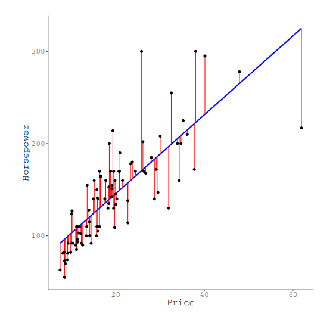

```{r global_options, include=FALSE}
knitr::opts_chunk$set(fig.pos = 'H')
```
  
---

# Introduction

---

We will use the following packages in this practical:

```{r, message=FALSE, warning=FALSE}
library(dplyr)
library(magrittr)
library(ggplot2)
library(gridExtra)
```

In this practical, you will perform regression analyses using `lm()` and inspect variables by plotting these variables, using `ggplot()`. 

--

# Loading the dataset

In the this practical, we will use the build-in data set `iris`. This data set contains the measurement of different iris species (flowers), you can find more information [here](https://www.rdocumentation.org/packages/datasets/versions/3.6.2/topics/iris). 


1. __Load the dataset and explain what variables are measured in the first three columns of your data set.__

```{r, include = params$answers}
data <- iris # load the data
head(iris)   # inspect the data

# The data set contains three different kinds of flowers. The petal leaves and sepal leaves are measured in length and width. All measurements are in centimeters.
```

---

# Inspecting the dataset 

A good way of eyeballing on a relation between two continuous variables is by creating a scatterplot. 

2. __Plot the sepal length and the petal width variables in a `ggplot` scatter plot (`geom_points`)__


```{r, message=FALSE, include = params$answers}
ggplot(data) +
  geom_point(aes(Sepal.Length, Petal.Width)) +
  xlab("Sepal length (in cm)") +
  ylab("Petal width (in cm)") +
  labs(col = "Species") +
  theme_minimal() +
  ggtitle("Plot of 2 continous variables")  + 
  theme(plot.title = element_text(hjust = 0.5))
```

A loess curve can be added to the plot to get a general idea of the relation between the two variables. You can add a loess curve to a ggplot with `stat_smooth(...., method = "loess")`.

3. __Add a loess curve to the plot under question 2, for further inspection.__

```{r, message=FALSE, include = params$answers}
ggplot(data, aes(x = Sepal.Length, y = Petal.Width)) +
  geom_point() +
  stat_smooth(method = "loess", se=F, col = "blue") +
  xlab("Sepal length (in cm)") +
  ylab("Petal width (in cm)") +
  labs(col = "Species") +
  theme_minimal() +
  ggtitle("Plot of 2 continous variables")  + 
  theme(plot.title = element_text(hjust = 0.5))

# The curve is added to the previous plot by the line `stat_smooth(method = "loess, se = F, col = "blue")`.
```

To get a clearer idea of the general trend in the data (or of the relation), a regression line can be added to the plot. A regression line can be added in the same way as a loess curve, the method argument in the function needs to be altered to `lm` to do so. 

4. __Change the loess curve of the previous plot to a regression line. Describe the relation that the line indicates.__  

```{r, message=FALSE, include = params$answers}
# In comparison to the previous plot, we now adjust "method = "loess"" to "method = "lm"".
ggplot(data, aes(x = Sepal.Length, y = Petal.Width)) +
  geom_point() +
  stat_smooth(method = "lm", se=F, col = "blue") +
  xlab("Sepal length (in cm)") +
  ylab("Petal width (in cm)") +
  labs(col = "Species") +
  theme_minimal() +
  ggtitle("Plot of 2 continous variables")  + 
  theme(plot.title = element_text(hjust = 0.5))

# The line indicates that there seems to be a more or less linear relation between the two plotted variables. This means that an increase in sepal length probably indicates an increase in petal width as well.
```

---

# Simple linear regression

With the `lm()` function, you can specify a linear regression model. You can save a model in an object and request summary statistics with the `summary` command.

When a model is stored in an object, you can ask for the coefficients with `coefficients()`. 

5. __Specify a regression model where Sepal length is predicted by Petal width. Store this model as `model1. Supply summary statistics for this model.__

```{r, include = params$answers}
# specify model
model1 <- lm(Sepal.Length ~ Petal.Width, 
             data = data)

# ask for summary
summary(model1)
```

6. __Based on the summary of the model, give a substantive interpretation of the regression coefficient.__

```{r, include = params$answers}
# The regression coefficient indicates the amount of change in the predicted variable when the predictor variable is changed with one unit. In case of the example model, this means that for every centimeter that a petal leave is width, the predicted length of a sepal leave increases with .89 cm.
```

7. __Relate the summary statistics and coefficients to the plots you made earlier.__

```{r, include = params$answers}
# The coefficients seem to be in accordance with the earlier plots. They are not exactly the same, but indicate a similar positive relationship.
```

---

# Multiple linear regression

You can add additional predictors to a model. This can improve the fit and the predictions. When multiple predictors are used in a regression model, it's called a Multiple linear regression. 

8. __Add Petal length as a second predictor to the model specified as `model1` and store this under the name `model2`, and supply summary statistics. Again, give a substantive interpretation of the coefficients and the model.__

```{r, include = params$answers}
# Specify additional predictors
model2 <- lm(Sepal.Length ~ Petal.Width + Petal.Length, 
             data = data)

# Ask for summary statistics again
summary(model2)

# When comparing the coefficients of model 2 with the coefficients of model 1, we can see that adding a predictor can change the coefficients of other predictors as well (it is a new model after all). In this example, it is notable that the coefficient for petal width has become a negative number, while it was positive in model 1.
```

---

# Categorical predictors

Up to here, we only included continuous predictors in our models. We will now include a categorical predictor in the model as well. 

When a categorical predictor is added, this predictor is split in several comparisons, where each group is compared to a reference group. In our example Iris data, the variable 'Species' is a categorical variable that indicate the species of flower. This variable can be added as example for a categorical predictor.

9. __Add species as a predictor to the model specified as `model2`, store it under the name `model3` and interpret the coefficients of this new model.__


```{r, include = params$answers}
# Create 3rd model with categorical predictor
model3 <- lm(Sepal.Length ~ Sepal.Width + Petal.Length + Species,
             data = data)

# Ask for summary data
summary(model3)

# In the output, we see that 'Species' has multiple rows of output, and that one species (Setosa) does not seem to show. Setosa is the reference group. The other two lines are those respecitve groups compared to the setosa group. This means that that the predicted sepal length of a versicolor would be .9558 lower than the predicted value of a setosas with the same values on the other variables.

```

---

# Model comparison

Now you have created multiple models, you can compare how well these models function (compare the model fit). There are multiple ways of testing the model fit and to compare models. In this practical, we use the following:

* AIC
* BIC
* RMSE
* Deviance test

10. __Compare the fit of the model specified under question 5 and the model specified under question 8. Use all four fit comparison methods listed above. Interpret the fit statistics you obtain/tests you use to compare the fit.__

```{r, include = params$answers}
AICvalues <- rbind(AIC(model1), AIC(model2))
BICvalues <- rbind(BIC(model1), BIC(model2))
RMSEvalues <- rbind(sqrt(mean(model1$residuals^2)), 
                    sqrt(mean(model2$residuals^2)))

modelfitvalues <- cbind(AICvalues, BICvalues, RMSEvalues)
rownames(modelfitvalues) <- c("model1", "model2")
colnames(modelfitvalues) <- c("AIC", "BIC", "RMSE")
modelfitvalues 

# We see that the second AIC is lower, and thus this model has a better fit-complexity trade-off. The BIC has the same conclusion as the AIC in this case. The RMSE of the second model is lower, and therefore indicates less error and a better fit.

# R2 difference test (deviance)
anova(model1, model2)

# The residual sum of squares is significantly lower for model 2, indicating a better fit for this model
```

---

# Residuals: observed vs. predicted

When fitting a regression line, the predicted values have some error in comparison to the observed values. The sum of the squared values of these errors is the sum of squares. A regression analysis finds the line such that the lowest sum of squares possible is obtained.

The image below shows how the predicted (on the blue regression line) and observed values (black dots) differ and how the predicted values have some error (red vertical lines).



When having multiple predictors, it becomes harder or impossible to make such a plot as above (you need a plot with more dimensions). You can, however, still plot the observed values against the predicted values and infer the error terms from there.

11. __Create a dataset of predicted values for model 1 by taking the outcome variable `Sepal.Length` and the `fitted.values` from the model.__
```{r, include = params$answers}
predvals1           <- cbind(data$Sepal.Length, model1$fitted.values)
colnames(predvals1) <- c("observed", "predicted")
predvals1           <- as.data.frame(predvals1)
```

12. __Create an observed vs. predicted plot for model 1 (the red vertial lines are no must).__
```{r, include = params$answers}
obspred1 <- ggplot(data = predvals1, aes(x = observed, y = predicted)) +
  geom_segment(aes(xend = observed, yend = observed), col = "red") +
  geom_abline(slope = 1, intercept = 0, col = "blue") +
  geom_point() +
  ggtitle("Observed vs. Predicted - model 1")
```

13. __Create a dataset of predicted values and create a plot for model 2.__
```{r, include = params$answers}
predvals2 <- cbind(data$Sepal.Length, model2$fitted.values)
colnames(predvals2) <- c("observed", "predicted")
predvals2 <- as.data.frame(predvals2)

obspred2 <- ggplot(data = predvals2, aes(x = observed, y = predicted)) +
  geom_segment(aes(xend = observed, yend = observed), col = "red") +
  geom_abline(slope = 1, intercept = 0, col = "blue") +
  geom_point() +
  ggtitle("Observed vs. Predicted - model 2")

```

14. __Compare the two plots and discuss the fit of the models based on what you see in the plots. You can combine them in one figure using the `grid.arrange()` function.__
```{r, include = params$answers}
grid.arrange(obspred1, obspred2, ncol = 2)

# Above, the observed vs. predicted plots for both model 1 (1 predictor) and model 2 (an additional predictor) are shown. In the second plot, it can be seen that all the red lines are shorter, indicating less error, a lower sum of squares, and thus a better fit.
```


---

# 