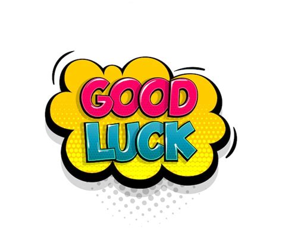

<style>
h2{
  color: black;
}

h3{
  color: black;
  font-family: "Rockwell";
  text-align: left;
}

h4{
  color: grey;
  font-family: "Rockwell";
  text-align: left;
  line-height: 1.5;
}

.forceBreak { -webkit-column-break-after: always; break-after: column; }

#centertext{
color: black;
text-align: center;
font-size: 35px;
line-height: 1.4;
}

#subtext
{
color: grey;
text-align: center;
font-size: 25px;
line-height: 1.4;
}

</style>

```{r setup, echo = FALSE, warning = FALSE}
library(ggplot2)
library(mvtnorm)
set.seed(235711)
theme_update(plot.background = element_rect(fill = "transparent", colour = NA))
knitr::opts_chunk$set(warning = FALSE, 
                      message = FALSE, 
                      dev.args = list(bg = "transparent"), 
                      fig.align = "center")
```


## This Workgroup Meeting

<h3>Finish Assignment 2:</h3>

- All elements present?
- Any questions/points of doubt? Today is the last moment to ask question!
- Visually neat? Concise presentation?

<h3> If all elements are done: </h3>

- Put more effort in the interpretation of the output (such as the logit coefficients).
- Spend some time on improving visualizations/plots

## Exam

<h3> Wednesday January 24th, 19:00, <br> EDUC: ALFA (general) / Ruppert Blauw (extra time) </h3> <br>


<h4> Check your Remindo access beforehand! </h4> 

## Course evaluation

<h4> Please fill in the course evaluation on: </h4>

<h3> https://caracal.uu.nl </h3>


## This is the Last Meeting

<p id = "centertext">Good luck with the exam next week & with finishing the course!</p>
<center>
</img>
</center>

<br>
<p id = "subtext"><b> Hand in Assignment 2 no later than today 17:00! </b></p>


